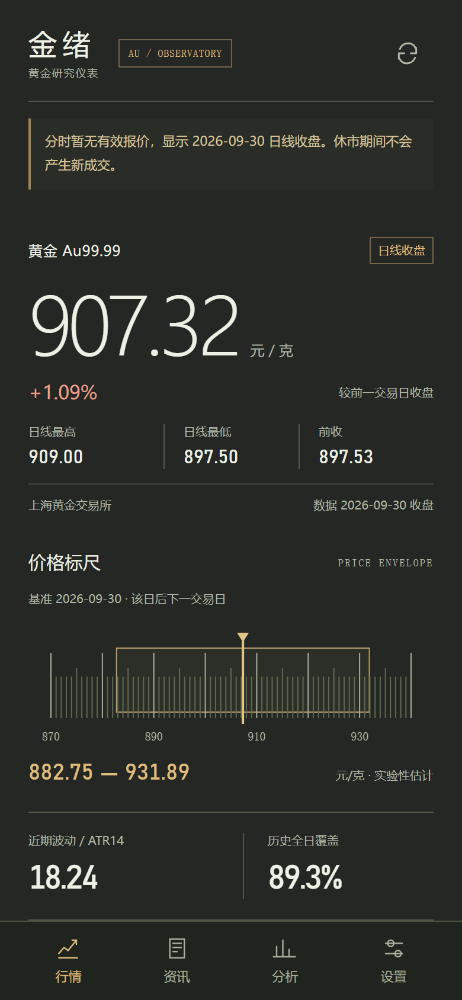

<div align="center">

# 金绪 · GoldSense

### 把黄金行情、资讯与短线研究，装进安卓手机

**免自建服务器 · 无需数据账号 · 本地分析 · 预测留档可验证**

Android 8.0+ · 人民币/克 · 上金所 Au99.99 · v1.3.0

[安装与部署](docs/DEPLOYMENT.md) · [预测方法](docs/SHORT_TERM_METHOD.md) · [验证记录](docs/VALIDATION.md) · [数据来源](docs/DATA_SOURCES.md)



</div>

> 截图使用历史数据快照展示界面，不代表当前实时金价。短线区间为实验性估计。

## 这个项目有什么用？

金绪是一款面向个人黄金观察与研究的安卓应用。它把国内金价、相关新闻、技术指标和下一交易日区间估计放在一起，帮助你看清价格变化、追踪消息线索，并持续检查预测结果。

手机直接访问公开数据来源，在本机完成计算和保存。无需租服务器、部署数据库或填写模型 API Key，适合希望低成本使用、理解分析依据并保留研究记录的用户。

## 项目优势

| 优势 | 具体作用 |
|---|---|
| 免服务器运行 | 安装 APK 即可使用；计算与记录保存在手机，无需维护后端 |
| 面向国内黄金观察 | 展示上金所 Au99.99，统一人民币/克单位，明确区分报价时间和抓取时间 |
| 分析依据可读 | 展示标题情绪关键词、均线、RSI、ATR及历史区间统计，方便理解结论来源 |
| 预测可以事后验证 | 保存首次预测、资讯首次采集时间、来源修订和采集空档，避免事后改写原结论 |
| 异常状态明确 | 休市、过期数据、刷新失败和样本不足分别提示；断网仍能查看已有缓存 |
| 专业仪表界面 | 石墨灰与琥珀色、动态价格标尺、清晰读数和事件时间轴，适配手机浏览 |

## 四个页面

- **行情**：国内黄金报价、日内高低、分时/历史走势、动态价格标尺、实验性预测区间和事件时间轴。
- **资讯**：黄金及相关宏观新闻，按标题措辞筛选偏多/偏空线索，查看命中依据并打开来源原文。
- **分析**：均线、Wilder RSI、ATR、下一交易日范围估计、历史覆盖率、数据质量检查与预测留档；支持手动输入标题离线分析。
- **设置**：刷新频率、数据源状态、CSV 导出与本地记录管理。

## 快速安装

1. 如果仓库已提供 Release，打开仓库的 [Releases 页面](https://github.com/chenxiyubp/gold-forecast/releases)，下载 `GoldSense-1.3.0.apk`；否则按[源码构建指南](docs/DEPLOYMENT.md)生成 APK。
2. 将 APK 传到安卓手机，用文件管理器打开，按系统提示允许安装。
3. 打开「金绪」并联网，等待行情、日线和资讯载入。
4. 查看设置页的数据源状态。休市时显示最近有效交易数据。

要求 Android 8.0 或以上，建议更新系统 Android System WebView / Chrome。同签名旧版可覆盖升级；卸载会删除本地记录，重要记录请先导出。

## 部署：只需构建并安装 APK

本项目是安卓本地应用，不需要云服务器、Docker、数据库或网站托管。GitHub 用于托管源码和分发安装包。

Windows 安装 Android Studio、SDK Platform 36、Build Tools 36.0.0、JDK 17 或以上以及 Python 3 后，在项目目录执行：

```powershell
powershell -NoProfile -ExecutionPolicy Bypass -File .\build-local.ps1
```

输出为项目根目录的 `GoldSense-1.3.0.apk`。自定义 SDK/JDK 路径、手机安装、升级签名、故障处理和 Android Studio 构建说明见 **[完整部署指南](docs/DEPLOYMENT.md)**。

## 数据与刷新

| 内容 | 来源及机制 |
|---|---|
| 黄金报价与历史日线 | 上海黄金交易所 Au99.99 公开数据 |
| 资讯 | 新浪贵金属入口；失败时使用新浪宏观备用入口并筛选相关标题 |
| 行情检查 | 前台默认每 60 秒，可选 30/120/300 秒或仅手动 |
| 资讯与历史日线 | 前台分别每 5 分钟、每小时检查一次 |
| 无网使用 | 已缓存数据、已有历史数据的本地计算和手动标题分析 |

免费公开入口不需要用户注册，但不保证持续可用或秒级实时。备用新闻仍来自新浪，不是独立供应商。刷新频率不等于源数据更新频率。进入后台或锁屏后暂停定时请求；当前没有全天后台盯盘、通知栏推送或自动交易功能。

## 短线分析如何工作？

基于历史日线的 ATR14 和历史价格偏移统计，估计下一交易日可能波动的区间，并进行按时间顺序的历史回放验证。新闻部分提供标题措辞与候选事件线索，**目前没有把新闻转化为经过验证的区间修正因子**。

历史全日覆盖率衡量预测区间是否包住实际日内高低价；区间越宽越容易覆盖，因此必须结合区间宽度与简单基准一起看。它不是上涨概率、交易胜率或收益承诺。过期严重、样本不足或关键数据质量异常时，不生成新的可用估计。

方法、限制和结果详见 [算法说明](docs/SHORT_TERM_METHOD.md)、[短线验证](docs/SHORT_TERM_RESULTS.md)、[留档规则](docs/JOURNAL.md)。

## 技术结构

```text
app/src/main/java/cn/goldsense/app/
  MainActivity.java    安卓生命周期、网络桥接与导出
  DataClient.java      固定 HTTPS 来源的数据获取与解析
app/src/main/assets/
  index.html          本地界面
  instrument.css/js   精密仪表风格与标尺
  app.js              展示、缓存与交互
  core.js             标题情绪与技术指标
  forecast.js         实验性短线区间与历史回放
  journal.js          预测留档与数据质量记录
  lexicon.js          本地分析词典
tests/                算法、数据与界面测试
docs/                 部署、数据来源、验证及第三方说明
```

Android 原生 Java + 本地 WebView（HTML/CSS/JavaScript）。界面随 APK 打包；联网由安卓模块完成，运行时不启动本地服务器，也不调用云端大模型。

## 验证状态

v1.3.0 已通过 56 项单元/回归测试；真实数据快照与合成输入的界面回归通过，覆盖四页及 320/390/540 像素宽度。APK 构建、对齐和 v2/v3 签名验证通过。尚未完成安卓真机验收。

```powershell
node --test tests/core.test.cjs tests/audit.test.cjs tests/forecast.test.cjs tests/journal.test.cjs tests/instrument.test.cjs
```

完整记录见 [VALIDATION.md](docs/VALIDATION.md)。这些工程测试用于检查实现，不等同于预测准确率证明。

## 来源与使用边界

本项目基于 GoldSentAnalysis 的黄金舆情研究思路及词典改造；原项目资料保留于 `docs/original-*`。短线均线筛选参考 short-term-stock-picker，相关 MIT 许可与参考资料位于 `docs/third-party/short-term-stock-picker/`，随应用保留第三方说明。

原项目的旧模型和收益曲线未作为本应用的收益宣传。仓库保留各来源许可说明；未对所有原始素材统一声明新的开源许可证。公开数据的使用仍受各来源规则约束。

应用用于行情观察与研究。上金所报价不等于银行积存金或金店零售价；标题措辞不等于事实核验后的事件影响，预测区间不构成确定交易信号。
